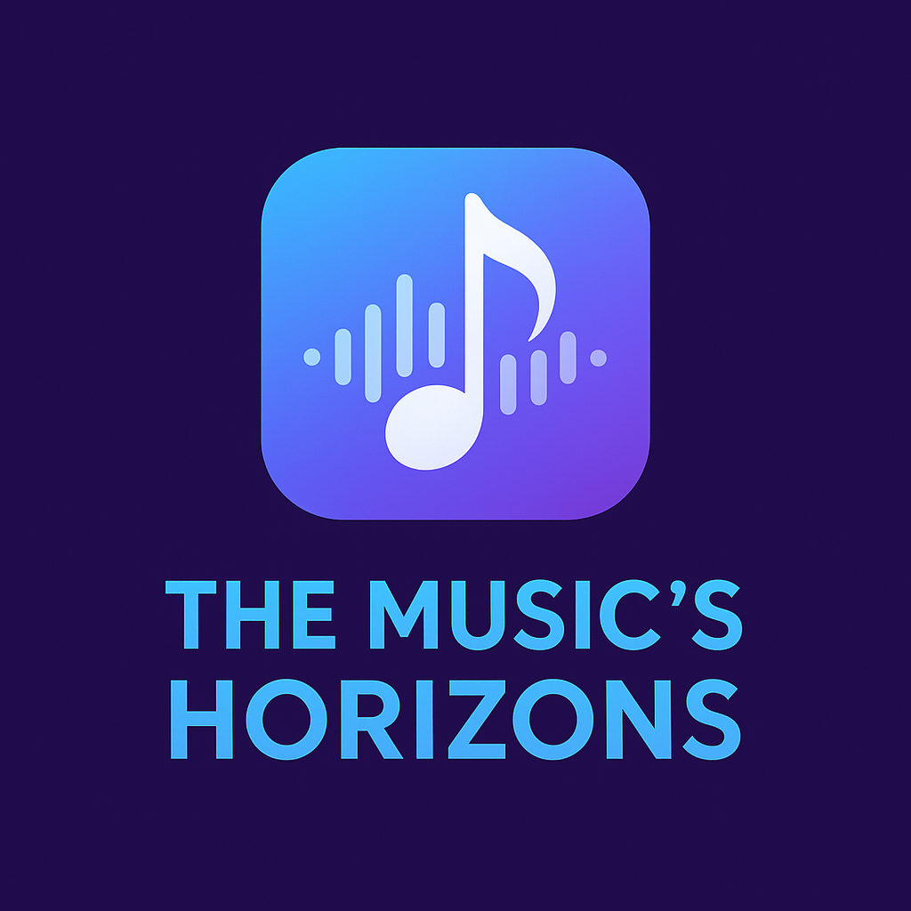

# The Musics Horizons

<p align="center">
  
</p>

### Tu universo musical en una sola aplicación.

**The Musics Horizons** es una aplicación Android diseñada para ser el compañero definitivo de todo amante de la música. Permite a los usuarios descubrir nueva música, encontrar conciertos y eventos cercanos, y llevar un registro de su propio universo musical. La aplicación cuenta con un robusto sistema de perfiles y un panel de administración con funcionalidades avanzadas.

---

## 🎯 Público Objetivo

Esta aplicación está dirigida a:

- **Amantes de la música** que asisten a conciertos y festivales con frecuencia.
- **Usuarios curiosos** que disfrutan descubriendo nueva música en cualquier lugar.
- **Desarrolladores Android** que buscan un proyecto de ejemplo con una arquitectura limpia y funcionalidades del mundo real.

---

## ✨ Características Principales

### Para el Usuario:

- **🎵 Reconocimiento de Canciones (Scan Audio):**
  - Utiliza el micrófono del dispositivo para identificar una canción que esté sonando en el ambiente.
  - Muestra información detallada del tema reconocido: artista, título, álbum y carátula.
  - Ofrece la opción de guardar la canción en el "horizonte" personal del usuario.

- **🎟️ Explorador de Eventos (Explore Events):**
  - Busca automáticamente conciertos y eventos musicales cercanos usando la ubicación GPS del usuario.
  - Permite realizar búsquedas manuales de eventos por palabra clave (ciudad, artista, etc.).
  - Guarda eventos de interés para consultarlos más tarde.

- **👁️ Escáner Visual (Scan Visual):**
  - Escanea códigos QR para abrir enlaces o mostrar información de forma rápida.

- **👤 Perfil de Usuario Personalizado:**
  - **Autenticación Segura:** Sistema de registro y login basado en email y contraseña.
  - **Foto de Perfil:** El usuario puede elegir una foto de su galería, que se muestra en su perfil y en la lista de usuarios para el administrador.
  - **Autogestión de Cuenta:**
    - **Cambiar Nombre:** Opción para modificar el nombre de usuario.
    - **Quitar Foto:** Restablece la imagen de perfil a la predeterminada.
    - **Borrar Cuenta:** Opción segura (con diálogo de confirmación) para eliminar permanentemente la cuenta y todos los datos asociados (canciones guardadas, eventos, etc.).

### Para el Administrador:

- **👑 Panel de Administración:**
  - Un botón de **"Gestión de Usuarios"** aparece exclusivamente en el perfil del administrador.
  - **Creación de Admin:** El primer usuario que se registre con el email `admin@gmail.com` obtiene privilegios de administrador.

- **📊 Gestión y Estadísticas de Usuarios:**
  - **Lista Completa de Usuarios:** Muestra a todos los usuarios registrados con su foto de perfil, nombre y email.
  - **Estadísticas de Uso:** Al seleccionar a un usuario, el administrador puede ver un resumen de su actividad:
    - Número de búsquedas de audio.
    - Número de escaneos visuales.
    - Número de búsquedas de eventos.
  - **Poderes de Moderación (con diálogos de confirmación):**
    - Cambiar el nombre de cualquier usuario.
    - Quitar la foto de perfil de cualquier usuario.
    - Eliminar permanentemente la cuenta de cualquier usuario.

---

## 🛠️ Entorno de Desarrollo

- **IDE:** Android Studio Hedgehog | 2023.1.1
- **Lenguaje:** Java
- **Base de Datos:** SQLite
- **Componentes Jetpack:** CameraX, ViewBinding, Navigation
- **Otras Librerías:** Glide, Google ML Kit, Google Play Services, Retrofit

---

## 📊 Diagramas de la Aplicación

A continuación, se presentan los diagramas que ilustran la arquitectura, flujo y diseño de la aplicación.
<details>
<summary>Ver todos los diagramas de diseño</summary>
  
### 1. Diagrama de Diseño (Flujo de Pantallas)

![Diagrama de Diseño (Técnico)] 

![Diagrama de Diseño (Básico)] 


### 2. Diagrama de Clases

![Diagrama de Clases (Técnico)] 

![Diagrama de Clases (Básico)] 


### 3. Diagramas de Flujo (Lógica Principal)

<details>
<summary>Ver todos los diagramas de flujo</summary>

#### Flujo de Autenticación
- **Login:**
  ![Flujo de Login (Técnico)] 

  ![Flujo de Login (Básico)] 


#### Flujo de Funcionalidades
- **Búsqueda de Eventos:**
  ![Flujo de Búsqueda de Eventos (Técnico)] 

  ![Flujo de Búsqueda de Eventos (Básico)] 

- **Reconocimiento de Canción:**
  ![Flujo de Reconocimiento de Canción (Técnico)] 

  ![Flujo de Reconocimiento de Canción (Básico)] 

</details>

### 4. Diagramas de Secuencia (Interacciones)

<details>
<summary>Ver todos los diagramas de secuencia</summary>

#### Secuencia de Inicio
- **Visión Técnica y Básica:**
  ![Secuencia de Inicio (Técnico)] 
 
  ![Secuencia de Inicio (Básico)]  


#### Secuencia de Reconocimiento de Audio
- **Visión Técnica y Básica:**
  ![Secuencia de Audio (Técnico)]  

  ![Secuencia de Audio (Básico)]  


#### Secuencia de Búsqueda de Eventos
- **Visión Técnica y Básica:**
  ![Secuencia de Eventos (Técnico)] 

  ![Secuencia de Eventos (Básico)] 


#### Secuencia de Gestión de Cuenta
- **Actualizar Perfil:**
  ![Secuencia de Actualizar Perfil (Técnico)]  
  ![Secuencia de Actualizar Perfil (Básico)]
  
- **Eliminar Usuario:**
  ![Secuencia de Eliminar Usuario (Técnico)] 

  ![Secuencia de Eliminar Usuario (Básico)] 

  
- **Guardar Evento:**
  ![Secuencia de Guardar Evento (Técnico)] 

  ![Secuencia de Guardar Evento (Básico)] 

  
</details>

---

## 🏗️ Arquitectura del Proyecto

El proyecto sigue una arquitectura limpia y organizada para facilitar su mantenimiento y escalabilidad. La estructura de paquetes principal es la siguiente:

- **`activities`**: Contiene las pantallas principales de la aplicación (ej: `LoginActivity`, `HomeActivity`).
- **`fragments`**: Contiene "trozos" de interfaz de usuario que son reutilizables.
- **`models`**: Define la estructura de los datos (clases POJO).
- **`network`**: Contiene las interfaces de Retrofit para definir los endpoints de las APIs.
- **`services`**: Orquesta la comunicación con las APIs, ocultando la complejidad.
- **`utils`**: Contiene clases de utilidad reutilizables (`SessionManager`, `CustomToast`).
- **`adapters`**: Conecta los datos con los `RecyclerView`.
- **`database`**: Gestiona la interacción con la base de datos SQLite.

---

## 🚀 Configuración del Proyecto

Para compilar y ejecutar el proyecto, es fundamental configurar las claves de API, ya que están protegidas y no se incluyen en el control de versiones.

1.  **Clonar el Repositorio:**

    ```bash
    git clone <URL_DEL_REPOSITORIO>
    ```

2.  **Configurar las Claves de API:**
    - En la raíz de tu proyecto Android, busca o crea el archivo `local.properties`.
    - Añade las siguientes líneas, reemplazando `"TU_CLAVE_AQUI"` con tus claves personales:

      ```properties
      TICKETMASTER_API_KEY="TU_CLAVE_DE_TICKETMASTER_AQUI"
      AUDD_API_TOKEN="TU_TOKEN_DE_AUDD_AQUI"
      ```

    - **Importante:** Asegúrate de que el archivo `build.gradle` (Módulo: app) contiene la configuración para leer estas claves.

3.  **Sincronizar y Ejecutar:**
    - Abre el proyecto en Android Studio.
    - Sincroniza Gradle haciendo clic en "Sync Now" si se te solicita.
    - Compila y ejecuta la aplicación en un emulador o dispositivo físico.

---

## 🧠 Lecciones Aprendidas

- **Gestión de Permisos:** La implementación de un `PermissionManager` centralizado simplificó enormemente la solicitud de permisos.
- **Seguridad de las Claves:** Se aprendió la importancia de no incluir claves de API directamente en el código, utilizando `local.properties`.
- **Persistencia de Imágenes:** Se resolvió un complejo problema de caché y permisos al copiar las imágenes de perfil al almacenamiento interno.
- **Interfaz de Usuario Coherente:** La creación de un `CustomToast` demostró la importancia de tener componentes de UI reutilizables.

---

## 📈 Mejoras Futuras

- **Migrar a Kotlin:** Refactorizar el código a Kotlin para un desarrollo más moderno y seguro.
- **Inyección de Dependencias:** Implementar Hilt o Dagger para mejorar la testeabilidad.
- **ViewModel y LiveData:** Adoptar componentes de la arquitectura de Android Jetpack para una UI más robusta.
- **Notificaciones Push:** Añadir notificaciones para alertar sobre eventos guardados.

---

## ✍️ Autor

- **Ignacio Navarrete**

---
